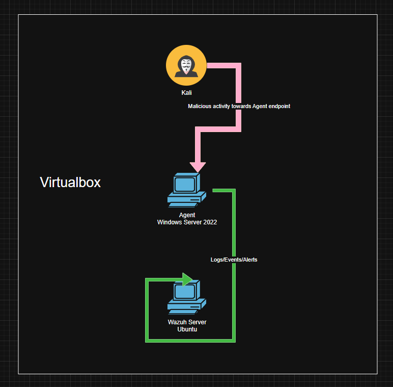
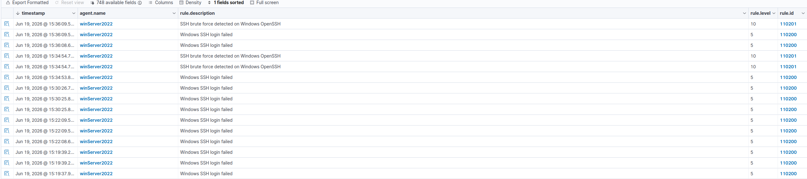
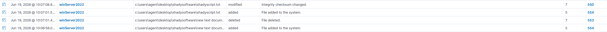
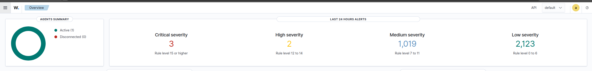

# Wazuh SIEM Implementation & Testing

A hands-on cybersecurity laboratory project focused on deploying, configuring, and testing a Wazuh SIEM environment using VirtualBox.

## Project Overview

The objective of this project was to gain practical experience with Security Information and Event Management (SIEM) technologies by implementing a Wazuh-based monitoring environment and validating its detection capabilities through simulated attacks.

The lab consists of:

- Ubuntu Server running Wazuh Server
- Windows Server 2022 running Wazuh Agent and Sysmon
- Kali Linux used for attack simulation

## Architecture

```
Kali Linux
     |
     | Malicious Activity
     v
Windows Server 2022
(Wazuh Agent + Sysmon)
     |
     | Security Logs & Events
     v
Ubuntu Server
(Wazuh Server)
```

## Environment

| Machine | Operating System | Purpose |
|----------|----------------|----------|
| Wazuh Server | Ubuntu 26.04 | SIEM Platform |
| Agent Endpoint | Windows Server 2022 | Monitored Endpoint |
| Attacker | Kali Linux | Attack Simulation |

**Virtualization Platform:** Oracle VirtualBox

## Installation

### Wazuh Server

Wazuh was installed on Ubuntu Server using the official Quickstart deployment method.

### Endpoint Monitoring

The Windows Server 2022 endpoint was configured with:

- Wazuh Agent
- Sysmon

This provided detailed endpoint telemetry and event collection.

## Detection Engineering

### Custom OpenSSH Rule

A custom rule was configured in `local_rules.xml` to detect indicators of OpenSSH brute-force activity.

### File Integrity Monitoring (FIM)

Realtime File Integrity Monitoring was enabled for:

```text
C:\Users\Agent
```

The objective was to detect unauthorized file creation and modification events.

## Testing

### OpenSSH Brute Force Simulation

A brute-force attack was simulated from Kali Linux against the monitored Windows endpoint.

Expected outcome:

- Detection rule triggered
- Wazuh generated alerts
- Attack indicators visible within the dashboard

### File Integrity Monitoring Validation

A test file was created within the monitored directory.

Expected outcome:

- File creation event detected
- File modification recorded
- Integrity monitoring alerts generated

## Results

### OpenSSH Detection

The custom detection rule successfully identified brute-force behavior and generated alerts indicating suspicious authentication activity.

### File Integrity Monitoring

File creation and modification activities were detected as expected, demonstrating successful configuration of realtime file monitoring.

## Skills Demonstrated

- SIEM Deployment
- Wazuh Administration
- Sysmon Configuration
- Windows Security Monitoring
- Detection Engineering
- File Integrity Monitoring (FIM)
- Security Event Analysis
- Linux Administration
- VirtualBox Lab Development
- Attack Simulation

## Lessons Learned

This project provided practical experience with SIEM technologies and demonstrated how security events can be collected, analyzed, and correlated to identify suspicious activity.

Deploying Wazuh and agents was relatively straightforward, while creating effective detection rules and understanding which events should be monitored proved to be the most challenging aspect of the project.

## Future Improvements

Potential enhancements include:

- Active Directory integration
- MITRE ATT&CK mapping
- PowerShell attack detection
- RDP brute-force monitoring
- Additional custom detection rules
- Multi-endpoint monitoring
- Dashboard customization

## Screenshots


- 
- 
- 
- 

## Author

**Martin Glas**

Cybersecurity Laboratory Project (2026)
